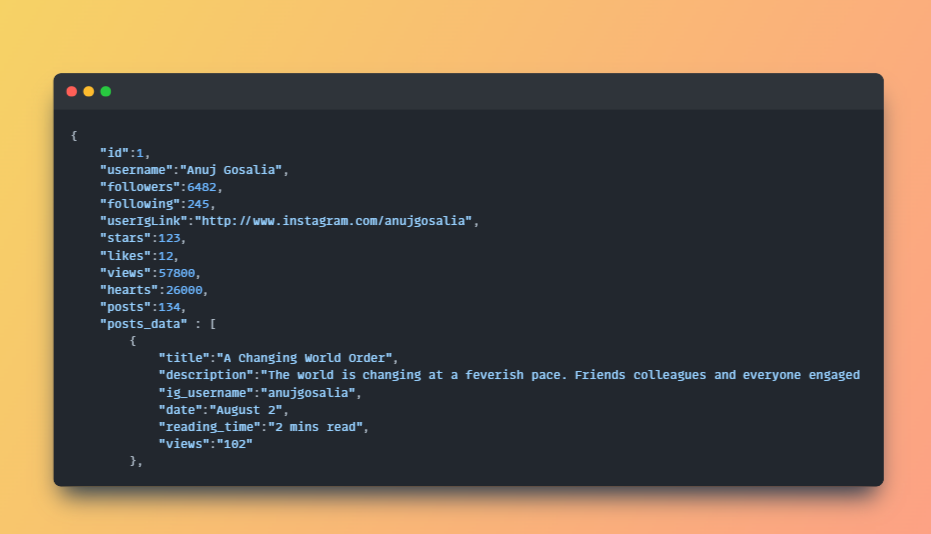

# TTT Assignment (https://6556970f0140ac13f6502b43--cerulean-griffin-dc095a.netlify.app/)

- This Repo contains the assignment given by @TerriblyTinyTales. Which does the following :
  1).Renders a "profile screen" as follows: [Profile](https://www.terriblytinytales.com/profile.jpeg) (this is a sample screenshot taken from mobile view)

  2).The profile data is hardcoded into this  file and then fetched into Stories component.

  3).The screen when opened on different mobile types, is rendered consistently. This can be checked by changing device types in chrome's developer tools.

# Solution:

- I have made three components Stories, Navbar and Card in the same order.  
- The card component is where all the magic happens, i have passed the userdata from stories component to card component as props and rendered the user post data to the card component. as shown here :  keeping in mind that if the length of the user description exceeds a particular amount , it replaces the user description with '...'

- The overall app looks like this in the mobile view : 

-  I have hosted this site on [Netlify](https://6556970f0140ac13f6502b43--cerulean-griffin-dc095a.netlify.app/) and All details is here on the github readme.

- **Libraries used** : 'Tailwind CSS' , 'React-Icons'

- To run this code on your system , Clone this repository and cd into the project directory and run the command **npm install** and then **npm run dev** and you're good to go.

- Thankyou , really looking forward to your response.<picture>
  <source srcset="https://fonts.gstatic.com/s/e/notoemoji/latest/1f388/512.webp" type="image/webp">
  
</picture>